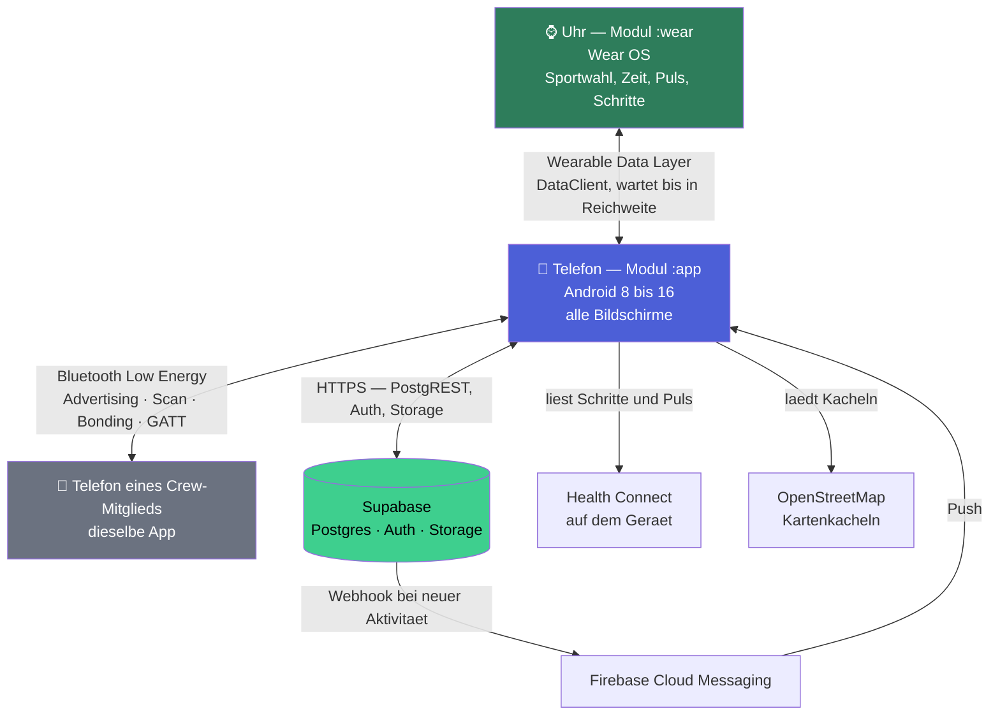
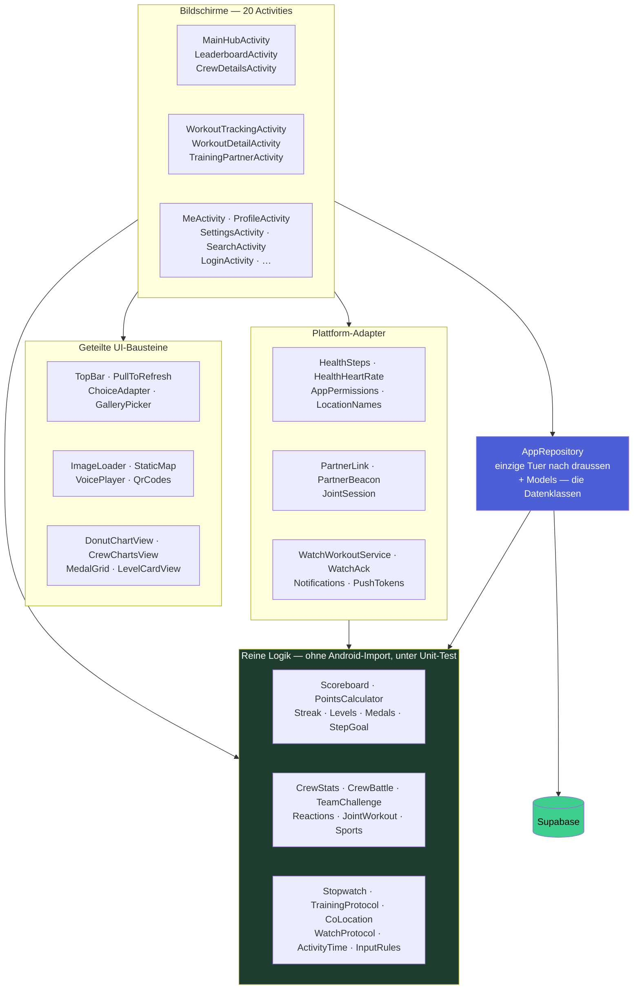
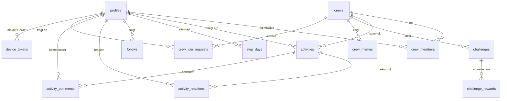
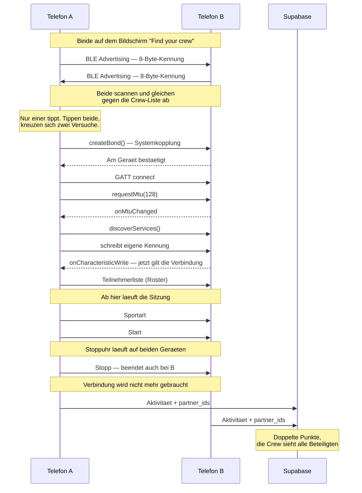

# Systemarchitektur

Von Hand geschrieben und gegen den Quellcode geprueft, nicht erzeugt. Die
Diagramme sind in Mermaid gesetzt und werden von GitHub direkt gerendert - wer
diese Datei im Browser oeffnet, sieht die Bilder und nicht den Text.

Vier Sichten, von aussen nach innen: die beteiligten Geraete und Dienste, die
Schichten innerhalb der Telefon-App, die Tabellen im Backend und zuletzt der
Ablauf, der am meisten Technik auf einmal beruehrt - das gemeinsame Training.

## 1. Systemuebersicht

CrewFit ist nicht eine App, sondern zwei: das Telefon (Gradle-Modul `:app`) und
die Uhr (`:wear`). Dazu kommen vier Aussenstellen. Bemerkenswert daran ist, wie
wenig davon dauerhaft verbunden sein muss: die Uhr braucht das Telefon nicht,
waehrend man laeuft, und zwei Telefone brauchen das Internet nicht, um ein
gemeinsames Training zu belegen.



**Warum die Uhr ein eigenes Modul ist.** Sie ist ein eigenes Geraet mit eigenem
APK, kein zweiter Bildschirm. Sie weiss, was nur sie wissen kann - Sportart,
Dauer, Puls - und uebergibt das dem Telefon, wo Kamera, Tastatur und Crew sind.
Das Workout reist als *Data Item* und nicht als Nachricht: eine Nachricht kaeme
nur an, solange das Telefon in Reichweite ist, und genau ohne Telefon
loszulaufen ist der Sinn einer Uhr. Das Item wartet auf der Uhr, bis sich beide
wiedertreffen. Naeheres in [WEAR.md](WEAR.md).

**Warum Push ueber einen Webhook laeuft.** Die App verschickt keine
Benachrichtigungen. Sie entstehen in Supabase, sobald in `activities` eine Zeile
angelegt wird. Ein Telefon, das gerade aus ist, muss dafuer nichts tun.
Naeheres in [PUSH.md](PUSH.md).

## 2. Schichten in der Telefon-App

Die wichtigste Regel steht ganz unten im Bild und laesst sich in einem Satz
pruefen: **`AppRepository` ist die einzige Klasse im Projekt, die Supabase
importiert.**

```
grep -rl "io.github.jan.supabase" app/src/main/java/
→ AppRepository.kt
```

Kein Bildschirm kennt das Backend. Was er braucht, bekommt er als fertiges
Datenobjekt.



**Warum die reine Logik eine eigene Schicht ist.** 28 Klassen im Modul kommen
ohne `import android` aus und laufen deshalb in der JVM, ohne Emulator, in
Millisekunden. Der Grossteil der Tests im Projekt richtet sich auf sie, und der
Nutzen ist nicht theoretisch: der Ueberlauf in der Schrittzahl-Berechnung
(`steps * 100 / goal` wird bei absurden Werten negativ) ist in genau so einem
Test aufgefallen und nicht auf dem Geraet.

Dass `Scoreboard.pointsFor` von der Rangliste **und** vom Level benutzt wird,
ist Absicht. Als zweite Rechnung waeren beide irgendwann auseinandergelaufen,
und ein Level, das nicht zur Rangliste passt, ist schlimmer als keines.

## 3. Daten im Backend

13 Tabellen und drei Buckets. Die verbindliche Fassung samt SQL, Regeln und
Begruendungen steht in [DATABASE.md](DATABASE.md); hier nur der Ueberblick.



Zwei Dinge, die das Bild nicht zeigen kann:

**Die Crew-Kennung ist ein Code, kein Fremdschluessel.** `crew_id` ist Text -
der Code, den man weitergibt oder als QR-Code scannt. Die Beziehungen oben sind
also teils logisch und nicht durchgehend von Postgres erzwungen.

**`activities.partner_ids` ist ein Array und hat deshalb keinen
Fremdschluessel.** Postgres kennt keinen Fremdschluessel auf Array-Elemente.
Verlaesst jemand die App, bleibt seine Kennung in fremden Workouts stehen, und
die App zeigt "Unknown" - das Training hat schliesslich stattgefunden. Ein
Eintrag zu verlieren waere die schlechtere Loesung.

Die drei Buckets im Storage: `avatars` (Profil- und Crew-Bilder), `photos`
(Workout-Fotos) und `voice_notes` (Sprachnotizen).

## 4. Ablauf: gemeinsames Training

Der Weg, der am meisten Technik auf einmal beruehrt, und der einzige, bei dem
zwei Geraete ohne Backend miteinander reden. Wer zusammen trainiert, bekommt die
doppelten Punkte - das ist nur etwas wert, wenn es sich nicht einfach behaupten
laesst.



**Warum die Kennung nur acht Byte hat.** Ein Advertising-Paket fasst 31 Byte
insgesamt. Eine volle 128-Bit-UUID braucht davon allein 16, und die
Konto-Kennung ist ihrerseits eine UUID, passt also gar nicht. Gesendet wird
deshalb nur ihre obere Haelfte, und sie wird gegen die Crew-Liste abgeglichen
statt fuer sich genommen geglaubt. Aus demselben Grund steht die Dienst-UUID in
ihrer 16-Bit-Form.

**Warum `requestMtu` und `discoverServices` nicht nacheinander stehen duerfen.**
Der GATT-Stack von Android bearbeitet genau eine Operation zur Zeit. Ruft man
beide direkt hintereinander auf, sieht es aus, als funktioniere es, und die
Verbindung faellt nach Sekunden. Der zweite Aufruf gehoert in `onMtuChanged`.

**Warum die Verbindung erst nach dem Schreibvorgang zaehlt.** `CONNECTED` in
`onConnectionStateChange` heisst nur, dass eine Verbindung steht - nicht, dass
der andere die eigene Kennung hat. Wer frueher bestaetigt, glaubt an einen
Partner, mit dem er noch nicht sprechen kann.

**Warum der Standort nicht geprueft wird.** Das war einmal eingebaut und ist
wieder herausgeflogen: zwei Leute beenden einen Lauf und tragen ihn zu
verschiedenen Zeiten von verschiedenen Orten ein. Die Pruefung bestrafte genau
den Normalfall. Geblieben ist, worauf es ankommt - wer die Uhr anhaelt, haelt
sie fuer alle an.
