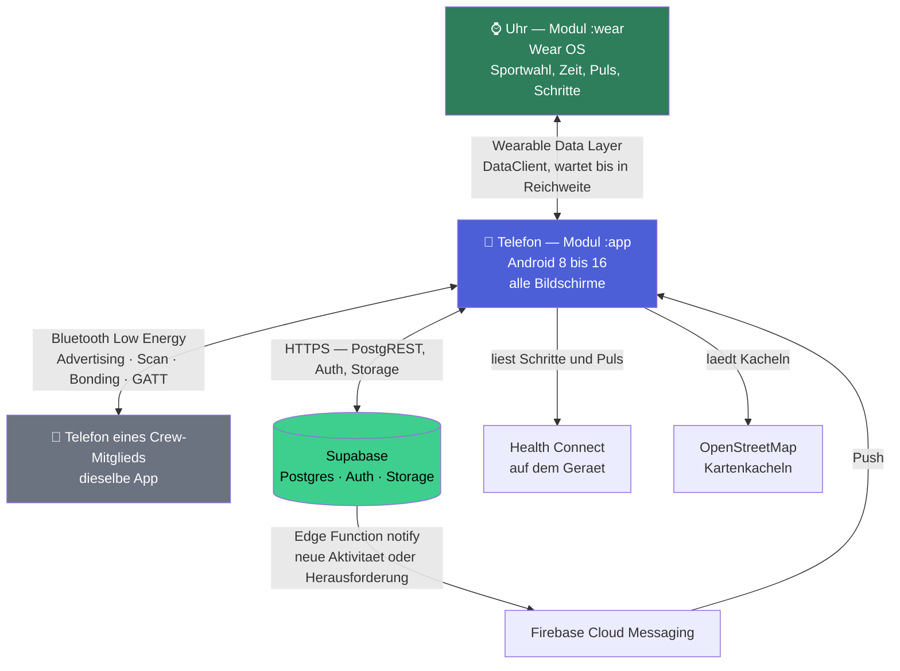
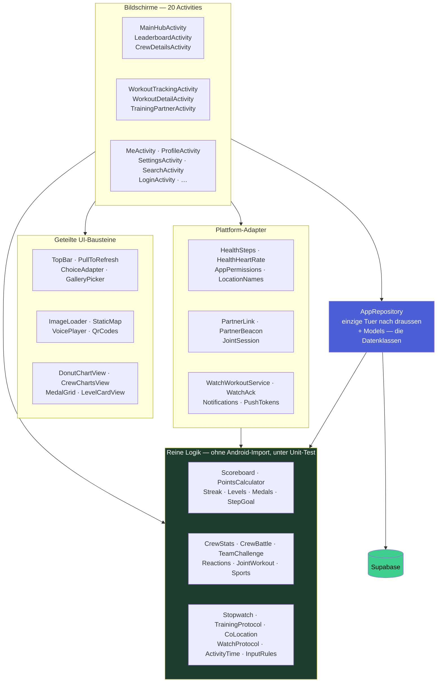
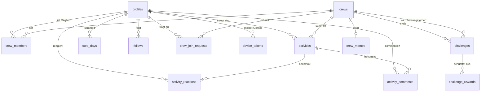
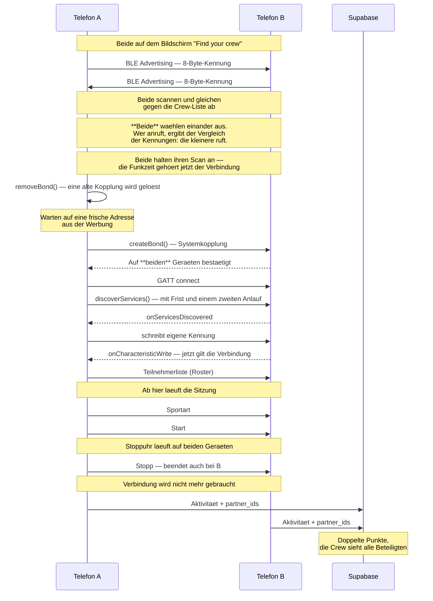

# Systemarchitektur

Von Hand geschrieben und gegen den Quellcode geprueft, nicht erzeugt. Die
Diagramme sind in Mermaid gesetzt und werden von GitHub direkt gerendert - wer
diese Datei im Browser oeffnet, sieht die Bilder und nicht den Text.

Vier Sichten, von aussen nach innen: die beteiligten Geraete und Dienste, die
Schichten innerhalb der Telefon-App, die Tabellen im Backend und zuletzt der
Ablauf, der am meisten Technik auf einmal beruehrt - das gemeinsame Training.

## 1. Systemuebersicht

CrewFit ist nicht eine App, sondern zwei: das Telefon (Gradle-Modul `:app`) und
die Uhr (`:wear`). Dazu kommen vier Aussenstellen. Bemerkenswert daran ist, wie
wenig davon dauerhaft verbunden sein muss: die Uhr braucht das Telefon nicht,
waehrend man laeuft, und zwei Telefone brauchen das Internet nicht, um ein
gemeinsames Training zu belegen.



**Warum die Uhr ein eigenes Modul ist.** Sie ist ein eigenes Geraet mit eigenem
APK, kein zweiter Bildschirm. Sie weiss, was nur sie wissen kann - Sportart,
Dauer, Puls - und uebergibt das dem Telefon, wo Kamera, Tastatur und Crew sind.
Das Workout reist als *Data Item* und nicht als Nachricht: eine Nachricht kaeme
nur an, solange das Telefon in Reichweite ist, und genau ohne Telefon
loszulaufen ist der Sinn einer Uhr. Das Item wartet auf der Uhr, bis sich beide
wiedertreffen.

Getragen wird das laufende Training von einem Vordergrunddienst der Art
`health` (`WorkoutService`), nicht von der Activity - eine Handflaeche auf dem
Display reicht sonst, und das System raeumt den Bildschirm samt Workout ab. Der
Dienst ist aber auch kein Versprechen, deshalb liegt der Zustand zusaetzlich in
den Preferences. Der Rueckweg ist neu: sobald das Telefon die Aktivitaet
wirklich gespeichert hat, legt es eine Bestaetigung unter `/crewfit/logged` ab,
und die Uhr meldet Sportart, Dauer und Punkte. Vorher endete das Training mit
"uebergeben" und danach kam nichts mehr. Naeheres in [WEAR.md](WEAR.md).

**Warum Push ueber einen Webhook laeuft.** Die App verschickt keine
Benachrichtigungen. Sie entstehen in Supabase - eine Edge Function `notify`
haengt an zwei Triggern: einer neuen Zeile in `activities` und einer neuen
Herausforderung in `challenges`. Welcher es war, erkennt sie an der Zeile
selbst; eine Challenge mit Gegner ist keine Aktivitaet. Ein Telefon, das gerade
aus ist, muss dafuer nichts tun. Naeheres in [PUSH.md](PUSH.md).

## 2. Schichten in der Telefon-App

Die wichtigste Regel steht ganz unten im Bild und laesst sich in einem Satz
pruefen: **`AppRepository` ist die einzige Klasse im Projekt, die Supabase
importiert.**

```
grep -rl "io.github.jan.supabase" app/src/main/java/
→ AppRepository.kt
```

Kein Bildschirm kennt das Backend. Was er braucht, bekommt er als fertiges
Datenobjekt.



**Warum die reine Logik eine eigene Schicht ist.** 28 Klassen im Modul kommen
ohne `import android` aus und laufen deshalb in der JVM, ohne Emulator, in
Millisekunden. Der Grossteil der Tests im Projekt richtet sich auf sie, und der
Nutzen ist nicht theoretisch: der Ueberlauf in der Schrittzahl-Berechnung
(`steps * 100 / goal` wird bei absurden Werten negativ) ist in genau so einem
Test aufgefallen und nicht auf dem Geraet.

Dass `Scoreboard.pointsFor` von der Rangliste **und** vom Level benutzt wird,
ist Absicht. Als zweite Rechnung waeren beide irgendwann auseinandergelaufen,
und ein Level, das nicht zur Rangliste passt, ist schlimmer als keines.

## 3. Daten im Backend

13 Tabellen und drei Buckets. Die verbindliche Fassung samt SQL, Regeln und
Begruendungen steht in [DATABASE.md](DATABASE.md); hier nur der Ueberblick.



Drei Dinge, die das Bild nicht zeigen kann:

**Ein Battle ist eine Zeile, keine zwei.** `crews` haengt zweimal an
`challenges`: einmal als die Crew, die sie stellt, und einmal ueber
`opponent_crew_id` als die, die herausgefordert wird. Zwei Zeilen - eine je
Crew - waeren die naheliegende Alternative und die schlechtere gewesen: Ziel,
Frist oder Art koennten auseinanderlaufen, und der Battle waere kein Battle
mehr, sondern zwei Challenges, die sich zufaellig aehneln. Wer gewonnen hat,
steht nirgends als Spalte, sondern ergibt sich aus `challenge_rewards`.

**Die Crew-Kennung ist ein Code, kein Fremdschluessel.** `crew_id` ist Text -
der Code, den man weitergibt oder als QR-Code scannt. Die Beziehungen oben sind
also teils logisch und nicht durchgehend von Postgres erzwungen.

**`activities.partner_ids` ist ein Array und hat deshalb keinen
Fremdschluessel.** Postgres kennt keinen Fremdschluessel auf Array-Elemente.
Verlaesst jemand die App, bleibt seine Kennung in fremden Workouts stehen, und
die App zeigt "Unknown" - das Training hat schliesslich stattgefunden. Ein
Eintrag zu verlieren waere die schlechtere Loesung.

Die drei Buckets im Storage: `avatars` (Profil- und Crew-Bilder), `photos`
(Workout-Fotos) und `voice_notes` (Sprachnotizen).

## 4. Ablauf: gemeinsames Training

Der Weg, der am meisten Technik auf einmal beruehrt, und der einzige, bei dem
zwei Geraete ohne Backend miteinander reden. Wer zusammen trainiert, bekommt die
doppelten Punkte - das ist nur etwas wert, wenn es sich nicht einfach behaupten
laesst.



**Warum die Kennung nur acht Byte hat.** Ein Advertising-Paket fasst 31 Byte
insgesamt. Eine volle 128-Bit-UUID braucht davon allein 16, und die
Konto-Kennung ist ihrerseits eine UUID, passt also gar nicht. Gesendet wird
deshalb nur ihre obere Haelfte, und sie wird gegen die Crew-Liste abgeglichen
statt fuer sich genommen geglaubt. Aus demselben Grund steht die Dienst-UUID in
ihrer 16-Bit-Form.

**Warum vor jedem gemeinsamen Training neu gekoppelt wird.** Das ist die
wichtigste Erkenntnis des ganzen Projekts, und sie liess sich lange nicht
fassen: Nach einer frischen Kopplung lief alles einwandfrei, beim naechsten
Versuch nichts mehr. Der Mitschnitt am Geraet zeigt, warum.

```
beginWith bond=12          <- gekoppelt
connected status=0         <- Verbindung steht nach 1,3 Sekunden
lookForServices started=true
   ... sechs Sekunden, keine Antwort
   ... sechs Sekunden, keine Antwort
The services stayed silent
```

Ist die Gegenseite gekoppelt, liefert `discoverServices()` zwar `true`, ruft
aber **nie** zurueck. Ohne Kopplung antwortet dieselbe Suche in einer Sekunde.
`refresh()` half nicht - die zweite Suche kam nach elf Millisekunden
unveraendert aus dem Zwischenspeicher zurueck.

Also wird eine bestehende Kopplung geloest, bevor verbunden wird. Ein frueherer
Anlauf daran scheiterte an einer Feinheit: die Adresse, mit der ein Geraet
wirbt, ist eine **zufaellige**, und Android loest sie nur zur echten Identitaet
auf, solange die Kopplung besteht. Wer nach dem Entkoppeln dieselbe Adresse
weiterbenutzt, ruft ins Leere - jeder Aufbau endete mit Status 133. Der Scan
meldet deshalb jede Sichtung und nicht nur die erste; der naechste Anlauf nimmt
die frische Adresse und koppelt sauber neu.

Nebenbei ist das genau das Verhalten, das man sich wuenscht: Vor jedem
gemeinsamen Training fragt das System auf **beiden** Geraeten nach, und beide
bestaetigen. Jeder Versuch ist derselbe.

**Warum waehrend des Verbindungsaufbaus nicht gesucht wird.** Ein Scan im Modus
`SCAN_MODE_LOW_LATENCY` horcht praktisch ohne Pause; daneben bleibt fuer die
Funkfenster einer gerade entstehenden Verbindung kaum etwas uebrig, und die
Dienstsuche verhungert. Wer zuerst tippte, rief in ein Geraet hinein, das noch
mit voller Leistung suchte - **diese Reihenfolge scheiterte reproduzierbar,
die umgekehrte gelang.** Angehalten wird deshalb auf beiden Seiten: beim
Anrufer, sobald er jemanden auswaehlt, und beim Angerufenen, sobald jemand
anklopft. Geworben wird weiter, sonst koennte die Gegenseite gar nicht
annehmen.

**Warum die Dienstsuche eine Frist hat.** `discoverServices()` gibt `false`
zurueck, wenn der Stack beschaeftigt ist, und manchmal `true`, ohne dass je ein
Rueckruf kommt. Beides sah vorher gleich aus: nichts, dreissig Sekunden lang,
bis die Verbindung von selbst abriss. Jetzt laeuft eine Frist, danach ein
zweiter Anlauf, und erst dann wird sauber abgebrochen.

**Warum `requestMtu` gar nicht mehr vorkommt.** Der GATT-Stack bearbeitet genau
eine Operation zur Zeit, und eine unbeantwortete MTU-Anfrage blockiert die
Schlange: die Verbindung stand, Schreibvorgaenge meldeten Erfolg und kamen
nirgends an. Mit der voreingestellten Paketgroesse passen zwanzig Byte in eine
Nachricht - genug fuer Sportart, Start und Stopp. Die Anfrage ist ersatzlos
entfallen.

**Warum die Meldung ueber die geglueckte Kopplung nicht auf die Adresse passt.**
`ACTION_BOND_STATE_CHANGED` traegt die **echte** Adresse des Geraets, angefragt
wurde aber mit der zufaelligen aus der Werbung. Ein strenger Vergleich verwarf
die Meldung, und die App wartete anschliessend die volle Frist ab, obwohl
laengst alles bestaetigt war.

**Warum beide auswaehlen und trotzdem nur einer anruft.** Frueher tippte nur
einer, und das war ein Rennen: eine Funkstrecke ist keine Einbahn, der eigene
GATT-Server meldet dieselbe Verbindung, die man gerade selbst aufbaut. Je
nachdem, welcher Rueckruf zuerst kam, hielt ein Geraet den eigenen Aufbau fuer
einen fremden Anruf und wuergte ihn ab - mal ging es, mal haengte die
Verbindung bis zum Zeitablauf. Jetzt waehlen beide, und wer anruft, entscheidet
ein Vergleich der Kennungen. Beide Geraete rechnen dasselbe aus, also ruft
genau einer, ohne dass sie sich verstaendigen muessten.

**Warum jede gescheiterte Verbindung geschlossen werden muss.**
`connectGatt()` fordert bei jedem Aufruf eine neue Registrierung im GATT-Stack
an, und Android vergibt davon nur eine feste Zahl je Prozess. Ohne `close()` im
Fehlerfall blieb je Fehlversuch eine haengen; waren sie aufgebraucht, endete
jeder weitere Aufbau sofort mit Status 133 - erst der zweite Versuch eines
Abends, dann jeder. Im Protokoll eines misslungenen Abends standen dreizehn
solcher Registrierungen nebeneinander.

**Warum die Verbindung erst nach dem Schreibvorgang zaehlt.** `CONNECTED` in
`onConnectionStateChange` heisst nur, dass eine Verbindung steht - nicht, dass
der andere die eigene Kennung hat. Wer frueher bestaetigt, glaubt an einen
Partner, mit dem er noch nicht sprechen kann.

**Warum der Standort nicht geprueft wird.** Das war einmal eingebaut und ist
wieder herausgeflogen: zwei Leute beenden einen Lauf und tragen ihn zu
verschiedenen Zeiten von verschiedenen Orten ein. Die Pruefung bestrafte genau
den Normalfall. Geblieben ist, worauf es ankommt - wer die Uhr anhaelt, haelt
sie fuer alle an.
